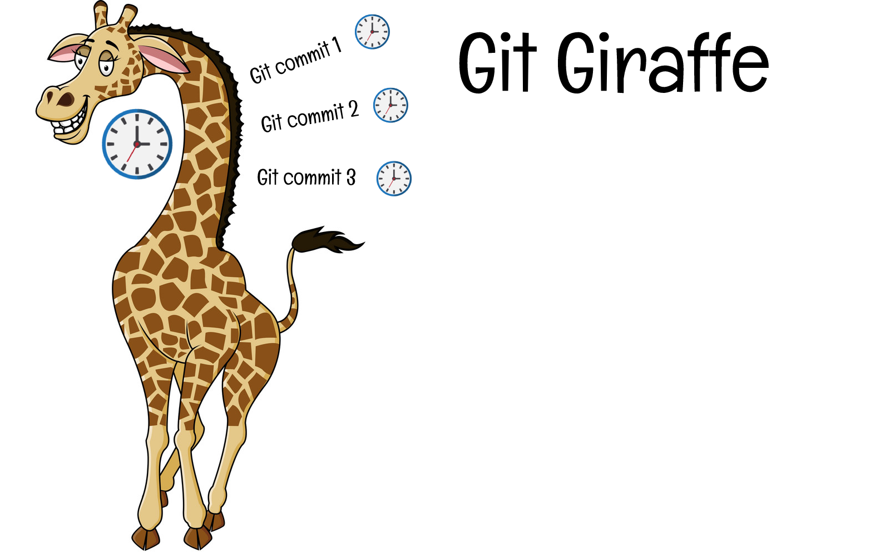

# Look busy for your boss with this cli tool!

gitgiraffe helps you getting a longer neck by stretching out your unpushed git commits over a longer period.

# Installation

`yarn global add gitgiraffe`

# Usage

Instead of a `git push`, just run `gitgiraffe push`, and your git commit dates will be stretched over your last commit date and the current time, but leave out non-working hours and days.

### How to push it later?

That's easy. Just use `at` in order to run `gitgiraffe push` at any future time. Make sure you don't change the branch or folder location/name in the meantime!

Example: run it at 6pm
`echo "gitgiraffe push" | at 1800 today`

Run at

# Config

### Edit hours

Edit hours that commits will be spreaded over:

`gitgiraffe --hours <starttime> <endtime>`

starttime and endtime must be in `Hmm` format, e.g. `900` for `9:00 AM` or `2115` for `9:15 PM` (in your local timezone)
defaults to 9:00 AM to 5:00PM

### Edit days

Edit days that commits will be spreaded over:

`gitgiraffe --days <day number>`

day number are the numbers of the day, 1 being monday and 7 being sunday. Example: `gitgiraffe --days 123456` will spread your commits over all days except sunday.

# How does it work?

when doing a `gitgiraffe push`, this happens:

1. gitgiraffe checks the git history in your current folder
2. gitgiraffe sees all commits that are unpushed on your current branch
3. gitgiraffe calculates what time the commit should be changed to based on the last pushed commit time, the current time, and your expected working hours/days.
4. gitgiraffe edits the git history of your current branch HEAD and puts the new times there
5. gitgiraffe runs `git push` after it changed the times

# Happy coding!

And of course, happy not coding!
